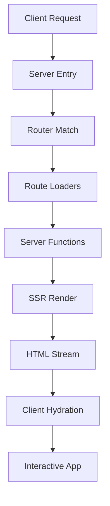

## What is TanStack Start?

TanStack Start is a full-stack web framework built on top of [TanStack Router](/router/introduction) that brings server-side rendering (SSR), streaming, server functions, API routes, and deployment capabilities to your applications.

While TanStack Router provides type-safe client-side routing with powerful data loading, TanStack Start extends these capabilities to the server, giving you a complete solution for building modern web applications.

## TanStack Start vs TanStack Router

Understanding the relationship between these two libraries is important:

### TanStack Router

- Client-side routing with type-safe navigation
- Route loaders and data fetching
- Search params and path params validation
- Prefetching and caching
- File-based or code-based routing
- Works in any React, Solid, or Vue application

### TanStack Start

- **Everything in TanStack Router, plus:**
- Server-side rendering (SSR) and streaming
- Server functions with type-safe RPC
- Vite-powered bundling and development
- Built-in deployment adapters
- Full-stack type safety from server to client
- Production-ready server infrastructure

<Note>
Think of TanStack Router as the foundation for client-side routing, and TanStack Start as the full-stack framework that includes Router plus server capabilities.
</Note>

## Key Features

<CardGroup cols={2}>
  <Card title="Server Functions" icon="server">
    Call server-side code from your client with full type safety and automatic RPC
  </Card>
  <Card title="SSR & Streaming" icon="water">
    Server-side rendering with streaming support for faster initial page loads
  </Card>
  <Card title="Type-Safe RPC" icon="shield-check">
    End-to-end type safety from your server functions to client calls
  </Card>
  <Card title="Vite Integration" icon="bolt">
    Lightning-fast development with Vite's hot module replacement
  </Card>
</CardGroup>

## Server Functions

One of the most powerful features of TanStack Start is server functions. These allow you to write server-side code that can be called directly from your client components with full type safety:

```tsx
import { createServerFn } from '@tanstack/react-start'

// Define a server function
export const getUser = createServerFn({ method: 'GET' })
  .inputValidator((id: string) => id)
  .handler(async ({ data: userId }) => {
    // This code runs only on the server
    const user = await db.users.findById(userId)
    return user
  })

// Call it from your client
function UserProfile({ userId }: { userId: string }) {
  const user = await getUser({ data: userId })
  return <div>{user.name}</div>
}
```

The server function is automatically converted to an API endpoint, and the client call becomes a type-safe RPC call.

## Framework Support

TanStack Start is available for multiple frameworks:

<Tabs>
  <Tab title="React">
    ```bash
    npm install @tanstack/react-start
    ```
    
    TanStack Start for React includes support for React Server Components patterns and streaming SSR.
  </Tab>
  <Tab title="Solid">
    ```bash
    npm install @tanstack/solid-start
    ```
    
    TanStack Start for Solid leverages Solid's fine-grained reactivity for optimal performance.
  </Tab>
  <Tab title="Vue">
    ```bash
    npm install @tanstack/vue-start
    ```
    
    TanStack Start for Vue brings full-stack capabilities to Vue 3 applications.
  </Tab>
</Tabs>

## How It Works

TanStack Start uses Vite to bundle both your client and server code:

1. **Development**: Run `vite dev` to start a development server with hot module replacement
2. **Server Functions**: The Vite plugin transforms server functions into API endpoints
3. **SSR**: Pages are rendered on the server first, then hydrated on the client
4. **Streaming**: Use React Suspense (or framework equivalent) to stream content as it loads
5. **Deployment**: Build outputs can be deployed to various platforms (Netlify, Vercel, Cloudflare, etc.)

## Architecture

TanStack Start follows a client-first architecture:



- **Server Entry**: Handles incoming requests
- **Router Match**: Determines which route to render
- **Route Loaders**: Execute server-side data loading
- **Server Functions**: Run server-only code
- **SSR Render**: Renders the initial HTML
- **HTML Stream**: Streams HTML to the client
- **Client Hydration**: Makes the page interactive

## When to Use TanStack Start

Choose TanStack Start when you need:

<Check>Server-side rendering for SEO or performance</Check>
<Check>Server functions to securely access databases or APIs</Check>
<Check>Streaming to improve perceived performance</Check>
<Check>Full-stack type safety</Check>
<Check>A complete deployment solution</Check>

Stick with TanStack Router alone if you're building:

<Check>A client-side only application (SPA)</Check>
<Check>An app that uses an existing backend API</Check>
<Check>A static site that doesn't need server functions</Check>

## Deployment Ready

TanStack Start uses [Nitro](https://nitro.unjs.io/) under the hood, which provides:

- Universal deployment adapters for multiple platforms
- Auto-detected deployment configuration
- Production-optimized builds
- Serverless and edge runtime support

Deployment targets include:

- Netlify
- Vercel
- Cloudflare Workers/Pages
- AWS Lambda
- Node.js servers
- And many more

## Next Steps

<CardGroup cols={2}>
  <Card title="Installation" icon="download" href="/start/installation">
    Install TanStack Start and set up your development environment
  </Card>
  <Card title="Quickstart" icon="rocket" href="/start/quickstart">
    Build your first full-stack app with server functions
  </Card>
  <Card title="Server Functions" icon="code" href="/start/concepts/server-functions">
    Learn how to use server functions for secure server-side operations
  </Card>
  <Card title="SSR Guide" icon="server" href="/start/concepts/ssr">
    Understand server-side rendering and streaming
  </Card>
</CardGroup>
